<웹 자동화>

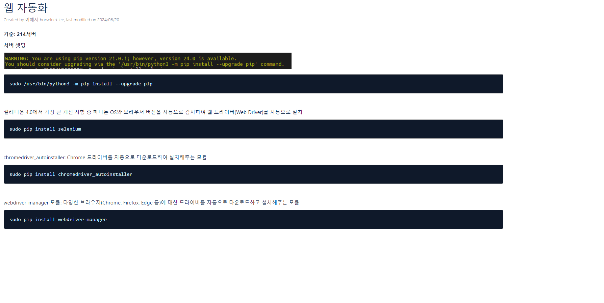
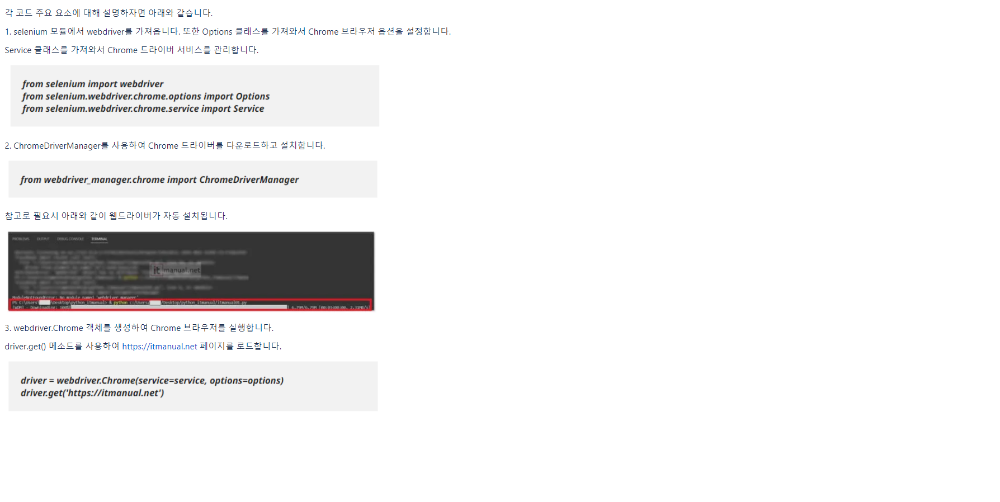

<추가>

add_experimental_option 메서드는 Chrome 브라우저의 실험적인 옵션을 추가할 때 사용하는 메서드입니다.

이 메서드를 사용하면 Chrome 브라우저의 다양한 기능을 사용할 수 있습니다.

'detach': True 옵션은 Chrome 브라우저 창이 즉시 닫히는 것을 방지하는 옵션입니다.

이 옵션을 사용하면 Python 스크립트가 종료되어도 Chrome 브라우저 창이 열려있게 됩니다.

이렇게 하면 필요한 경우에 브라우저 창을 수동으로 닫을 수 있으므로 유용합니다.

'excludeSwitches': ['enable-logging'] 옵션은 불필요한 콘솔 메시지를 제거하는 옵션입니다.

Chrome 브라우저를 실행하면 콘솔 메시지가 많이 출력되는데, 이 옵션을 사용하면 이러한 콘솔 메시지를 출력하지 않도록 설정할 수 있습니다.

이렇게 하면 로그 메시지가 줄어들어 디버깅이 쉬워집니다.

참고
https://itmanual.net/%ED%8C%8C%EC%9D%B4%EC%8D%AC-%EC%9B%B9%EC%9E%90%EB%8F%99%ED%99%94-1-%EC%85%80%EB%A0%88%EB%8B%88%EC%9B%80-%EC%84%A4%EC%B9%98-%EB%B0%8F-%ED%99%98%EA%B2%BD%EC%84%A4%EC%A0%95-%EC%9B%B9%EB%93%9C%EB%9D%BC/

<서버 셋팅>

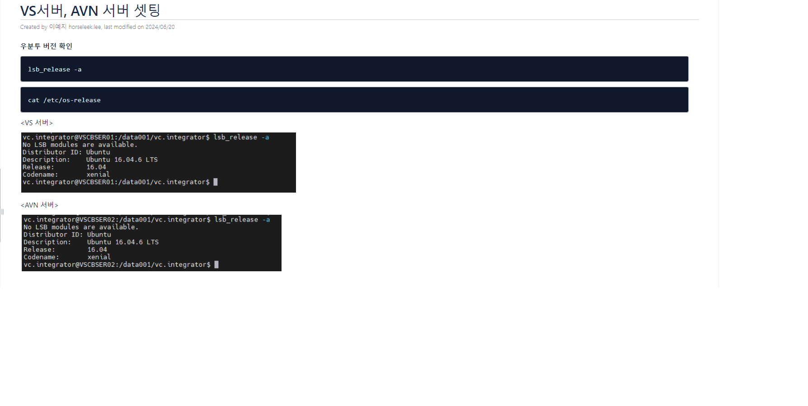
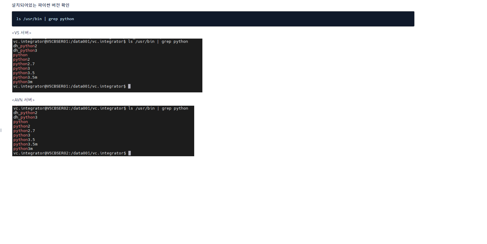
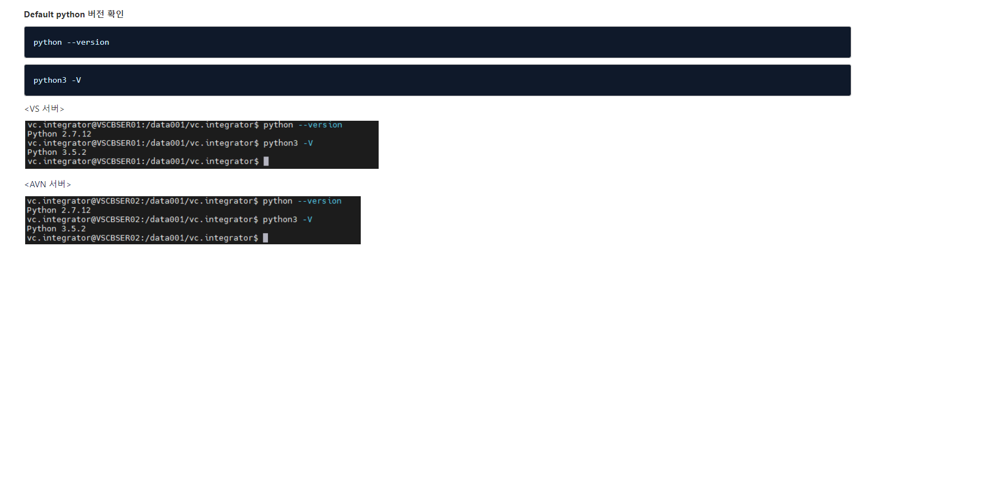
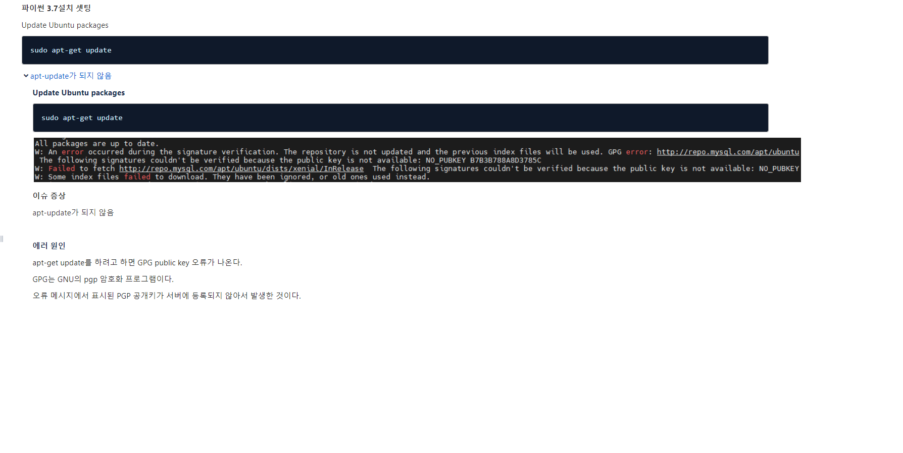
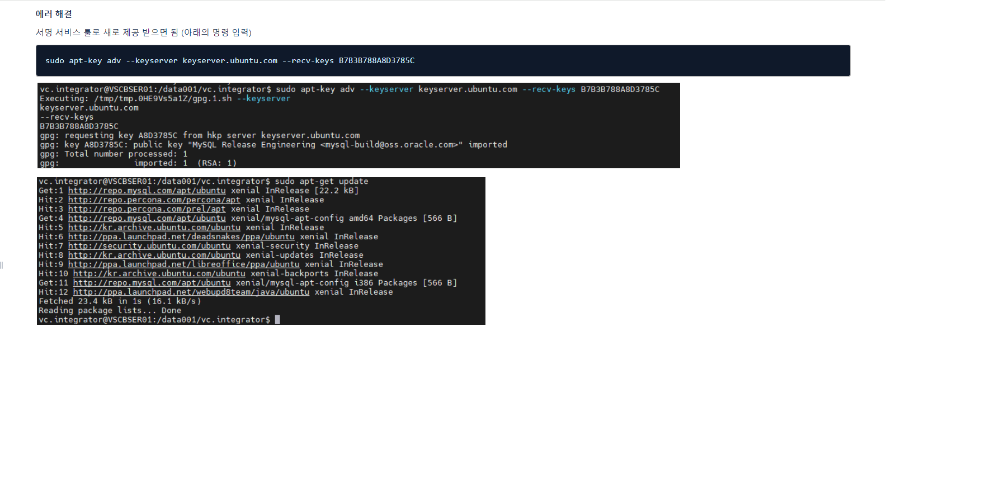

참고
https://covenant.tistory.com/110
https://musclebear.tistory.com/132

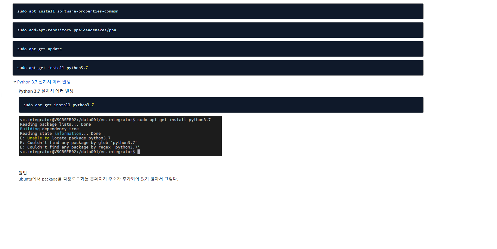
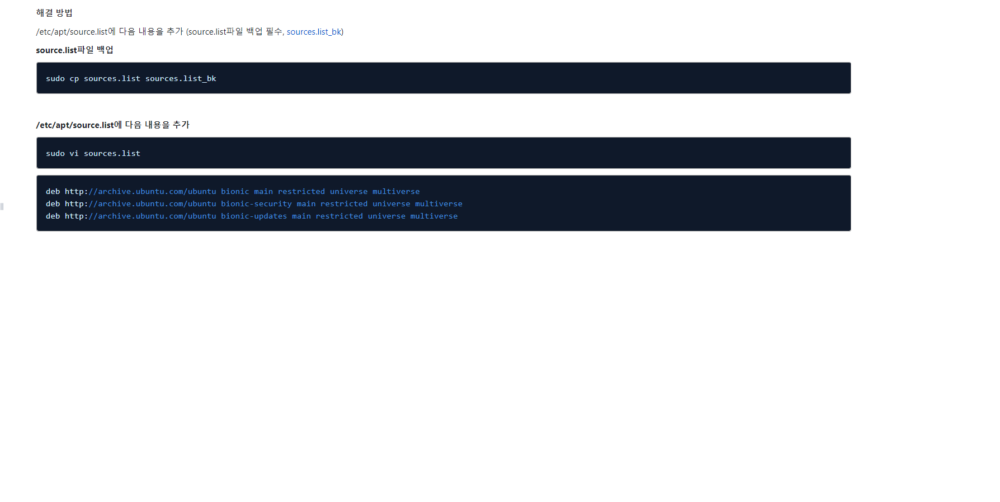

참고
https://coding-factory.tistory.com/750
https://seong6496.tistory.com/400
https://velog.io/@sangeun-jo/E-Unable-to-locate-package

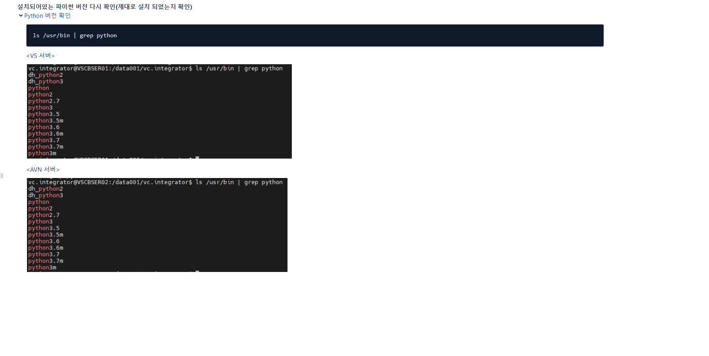
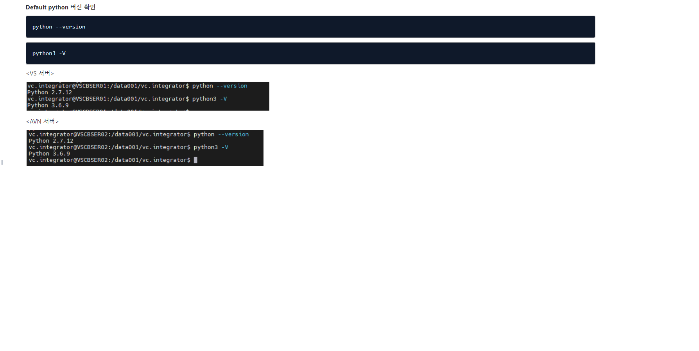
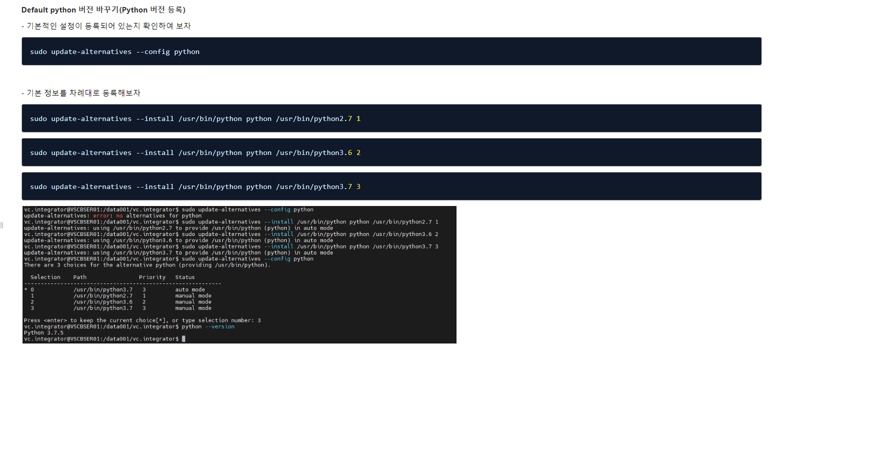
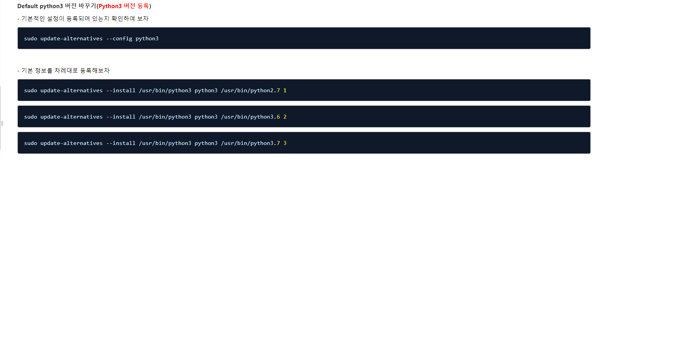

참고
https://juntheworld.tistory.com/123
https://www.whatwant.com/entry/Python3-%ED%99%98%EA%B2%BD-%EB%A7%8C%EB%93%A4%EA%B8%B0-%EB%B2%84%EC%A0%84-%EB%B3%80%EA%B2%BD%ED%95%98%EA%B8%B0-in-Ubuntu

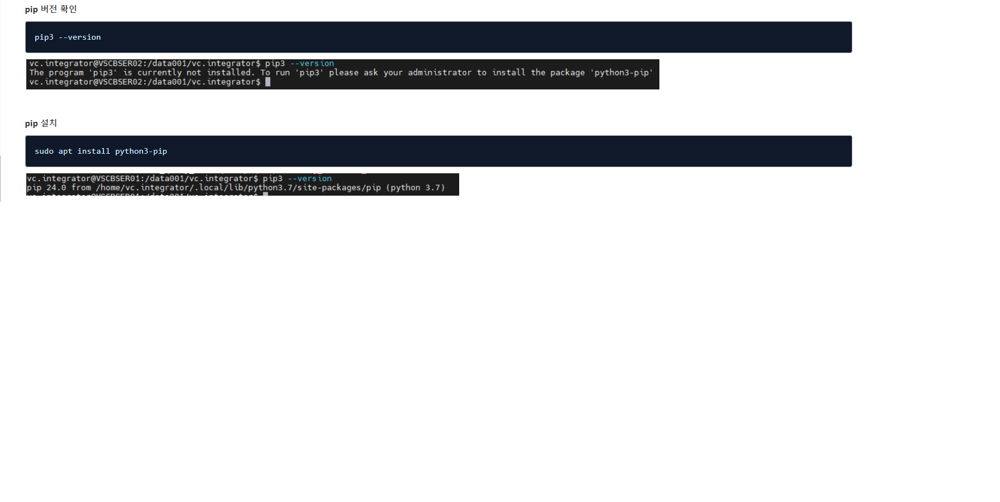

참고
https://projooni.tistory.com/entry/ubuntu%EC%97%90%EC%84%9C-apt-get%EC%9C%BC%EB%A1%9C-python37-pip-%EC%84%A4%EC%B9%98-%EB%B0%8F-%EC%8B%AC%EB%B3%BC%EB%A6%AD-%EB%A7%81%ED%81%AC-%EC%84%A4%EC%A0%95%ED%95%98%EA%B8%B0

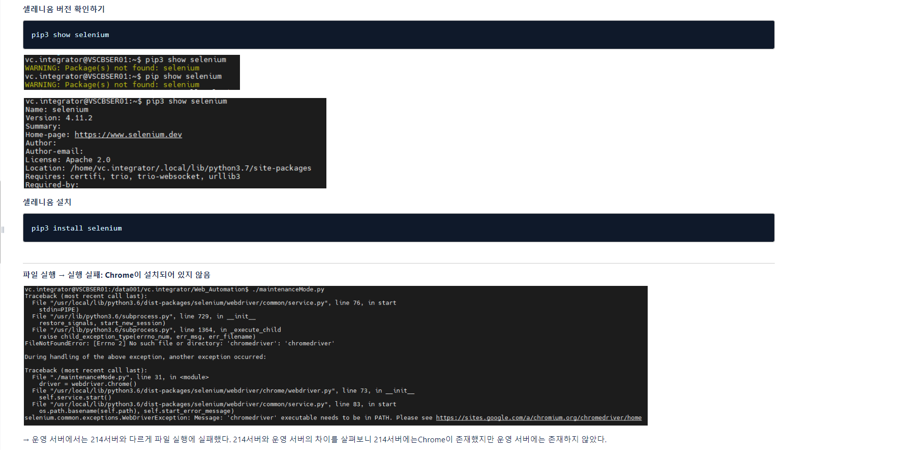
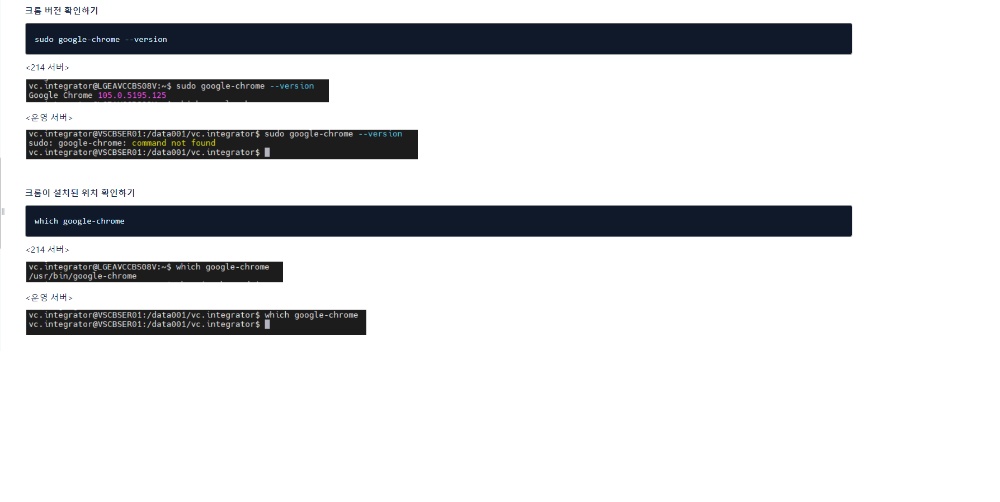
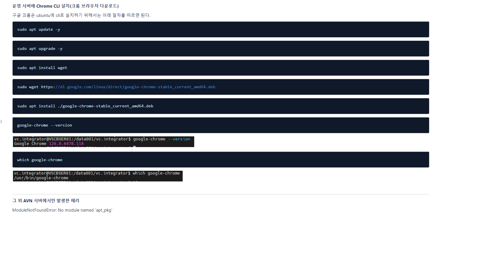

참고
https://peanut159357.tistory.com/182

<우분투에서 셀레니움 사용 시 한글 깨짐>

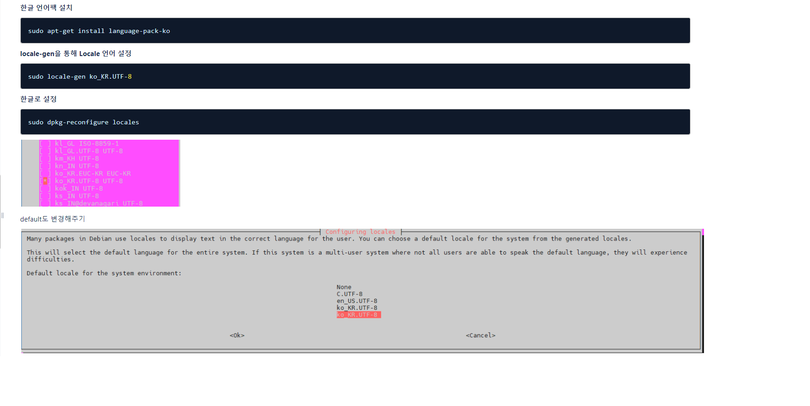
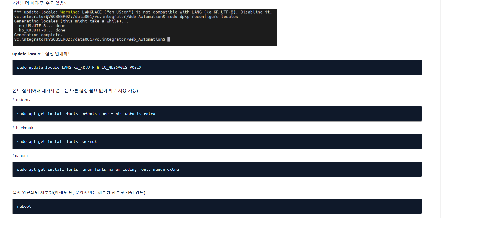

참고
https://seong6496.tistory.com/402